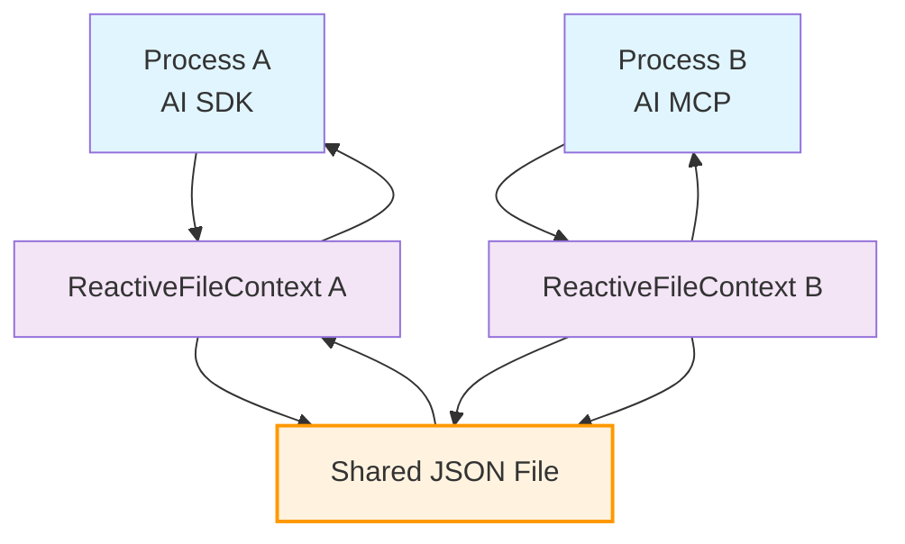

# fs-ctx

A reactive file system context library for seamless cross-process data sharing.

## Features

- 🔄 **Bi-directional Sync**: Automatic synchronization between in-memory objects and file system
- ⚡ **Reactive**: Built-in reactivity with automatic change detection
- 🚀 **Cross-Process**: Share context data seamlessly across multiple processes
- 🎯 **TypeScript**: Full TypeScript support with type safety

## Cross-Process Architecture



## Installation

```bash
pnpm install fs-ctx
```

## Quick Start

**Process A:**
```typescript
import { createFileContext } from 'fs-ctx'

// Create a reactive context
const ctx = createFileContext('my-app', {
  data: {
    foo: 'bar',
    count: 0
  }
})

// Changes are automatically saved to file
ctx.value.foo = 'baz'
ctx.value.count = 42
```

**Process B:**
```typescript
import { createFileContext } from 'fs-ctx'

// Connect to the same context
const ctx = createFileContext('my-app')

// Read data from Process A
console.log(ctx.value.foo) // 'baz'
console.log(ctx.value.count) // 42

// Changes sync back to Process A
ctx.value.status = 'ready'
```

## API Reference

### `createFileContext(id, options?)`

Creates a reactive file context.

**Parameters:**
- `id` (string): Unique identifier for the context (required)
- `options?` (FSContextOptions<T>): Configuration options including initial data (optional)

**Returns:** `ReactiveFileContext<T>` with `value` property and `dispose()` method

### Configuration Options

```typescript
interface FSContextOptions<T = any> {
  tempDir?: string // Custom temp directory
  cleanup?: boolean // Auto-remove file on dispose (default: true)
  data?: T // Initial data for the context
}
```
